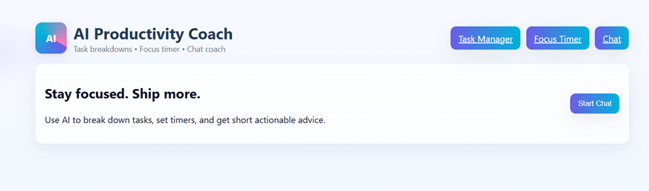

# 🧠 AI Productivity Coach



---

## 💡 Abstract
The **AI Productivity Coach** is an intelligent personal assistant designed to enhance focus, time management, and overall work-life balance using **Artificial Intelligence**.  
It acts as a **virtual mentor**, providing personalized task guidance, motivational support, and actionable productivity insights.

By leveraging **Natural Language Processing (NLP)**, **Machine Learning (ML)**, and **behavioral analytics**, the system engages users conversationally — understanding their habits, identifying inefficiencies, and recommending strategies to optimize performance.  
This project aims to make productivity management more **human, empathetic, and data-driven**.

---

## 🧭 1. Introduction
In today’s era of multitasking and digital distractions, maintaining productivity and mental wellness is a daily struggle.  
Traditional tools like calendars or to-do lists help organize tasks but lack **emotional intelligence** and **adaptive feedback**.

The **AI Productivity Coach** bridges this gap by combining **AI automation** with **psychological insights**.  
It communicates with users like a real coach — encouraging, analyzing, and guiding them toward achieving focus, consistency, and motivation through an engaging chatbot-style interface.

---

## 🎯 2. Objectives
The key objectives of the AI Productivity Coach are:

- 🤖 Develop an AI-driven productivity assistant for personalized planning.  
- 🧩 Provide real-time motivation, feedback, and improvement suggestions.  
- 🕒 Integrate task management, focus timers, and well-being analytics.  
- 💬 Use NLP and sentiment analysis to understand user emotion and tone.  
- 🧘 Promote habit-building and self-discipline through interactive coaching.

---

## ⚙️ 3. System Overview
The AI Productivity Coach is structured around three core components:
1. **Task & Goal Management System**  
2. **AI Chatbot Coach**  
3. **Performance Analytics Dashboard**

### 🔑 Key Modules

1. **User Management Module**  
   - Manages user profiles, login data, and personalized goals.  
   - Ensures secure data storage and privacy.

2. **Task Planner and Reminder Module**  
   - Allows creation, prioritization, and scheduling of tasks.  
   - Sends intelligent reminders based on workload and time availability.

3. **AI Chatbot Module**  
   - Engages users in natural, conversational dialogue.  
   - Offers productivity advice, motivational messages, and stress-relief tips.  
   - Provides focus reminders and self-assessment feedback.

4. **Sentiment & Behaviour Analysis Module**  
   - Analyzes user text to detect emotional tone (e.g., stress, motivation).  
   - Adjusts responses dynamically to maintain empathy and encouragement.

5. **Performance Analytics Dashboard**  
   - Displays charts for task progress, time utilization, and success rate.  
   - Enables self-evaluation and continuous improvement tracking.

---

## 🌟 4. Features
The **AI Productivity Coach** includes a rich set of adaptive features:

- 💬 **Conversational Interface:** Chat naturally with your AI coach.  
- ⏰ **Smart Reminders:** Timely notifications for tasks and deadlines.  
- 📊 **Productivity Tracking:** Monitors task completion and focus duration.  
- 🧘 **Mood & Stress Detection:** Identifies emotional tone for supportive replies.  
- 🎯 **Goal Setting:** Helps plan short- and long-term objectives.  
- 📈 **AI-Based Insights:** Suggests personalized optimization strategies.  
- 🔒 **User Privacy:** Secure login and encrypted data handling.  
- 🌙 **Focus Mode:** Enables distraction-free work periods.  

---

## 💫 5. Speciality of the System
The **AI Productivity Coach** stands out for its fusion of **emotional intelligence** and **AI analytics** — making it much more than a regular task manager.

### 🔹 Key Specialities:
- 🧠 Understands human psychology through NLP and tone analysis.  
- 💬 Interacts empathetically like a real-life coach.  
- 🔁 Adapts dynamically to each user’s habits and performance.  
- 🌈 Encourages during stress and celebrates progress.  
- 🤝 Bridges technology and psychology for personalized growth.  

This system transforms digital productivity into **an interactive, empathetic experience** rather than just data tracking.

---

## 🧰 6. Technologies Used

| Component | Technology |
|------------|-------------|
| **Frontend** | HTML, CSS, JavaScript |
| **Backend** | Python (Flask Framework) |
| **AI/NLP** | NLTK, Transformers (for sentiment & language processing) |
| **Database** | SQLite / MySQL |
| **Tools** | Visual Studio Code, Flask Server |
| **Optional Integrations** | Google Calendar API, OpenAI API for advanced responses |

---

## 🏗️ 7. System Architecture
The project follows a **three-tier architecture** for modularity and scalability:

1. **Frontend Layer:**  
   - User dashboard and chat interface.  
   - Interactive components for task creation, focus timer, and chatbot.

2. **Backend Layer:**  
   - Python Flask server managing chatbot responses, reminders, and analytics.

3. **Database Layer:**  
   - Stores user data, task records, progress logs, and sentiment results.

---

## 🚀 8. Advantages
- ⏱️ Boosts focus and discipline through actionable reminders.  
- 🔍 Tracks user productivity trends and performance metrics.  
- 💬 Adapts to each user’s emotional and behavioral patterns.  
- 😌 Detects stress or burnout for supportive feedback.  
- 📅 Simplifies task organization, tracking, and goal planning.  
- 🧭 Promotes a growth mindset and personal accountability.  

---

## 🔮 9. Future Scope
The **AI Productivity Coach** can evolve further with next-generation features such as:

- 🎙️ **Voice Interaction:** Speech recognition and audio feedback.  
- 📱 **Mobile App Integration:** Cross-platform access on Android/iOS.  
- 🧠 **AI-Based Task Prioritization:** ML-driven ranking of task importance.  
- ⌚ **Integration with Wearables:** Real-time stress and focus tracking.  
- 🎨 **Emotion-Adaptive UI:** Interface color and tone changing based on mood.  

---

## 🏁 10. Conclusion
The **AI Productivity Coach** represents a significant step toward building emotionally intelligent digital assistants that **enhance human potential**.  
By combin

---

## ⚙️ How to Run
1. Clone the repository  
   ```bash
   git clone https://github.com/yourusername/ai-productivity-coach.git
   cd ai-productivity-coach
